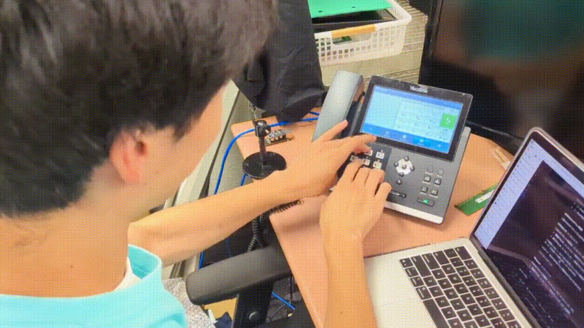
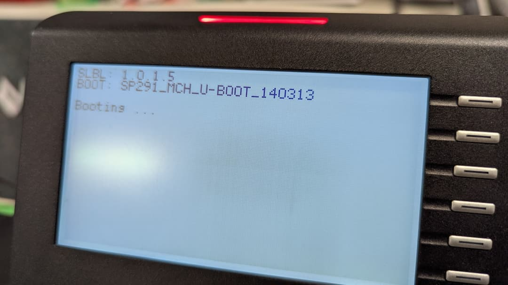
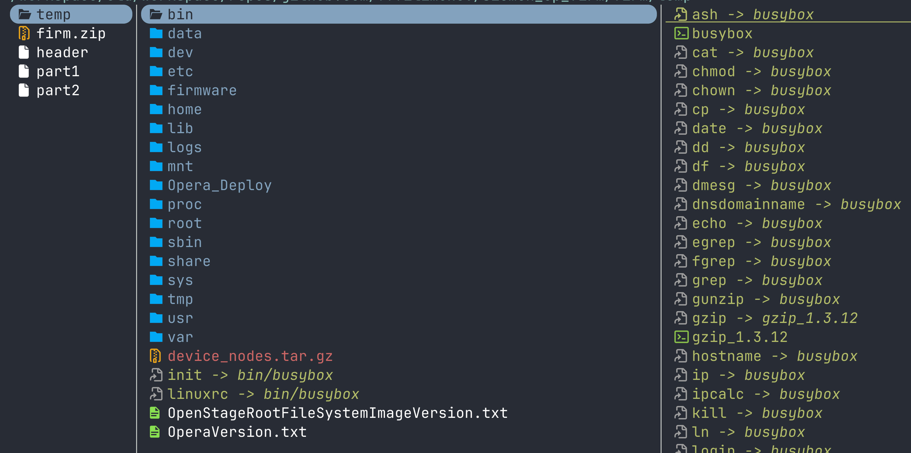
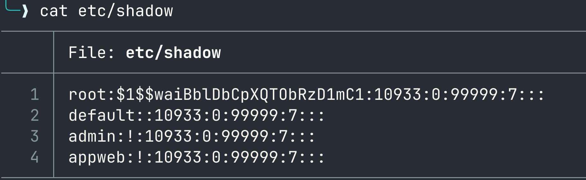
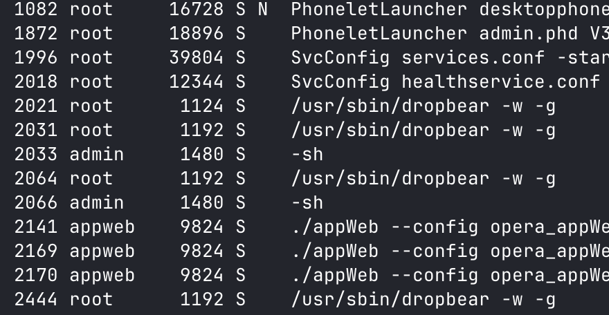
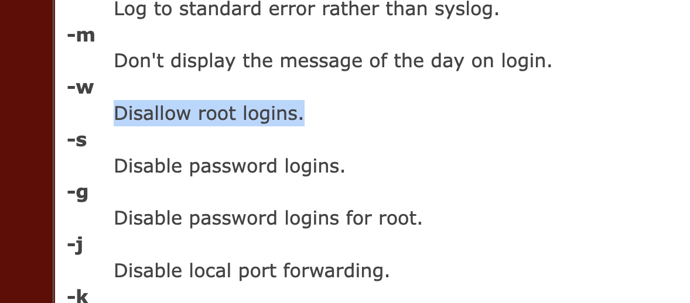
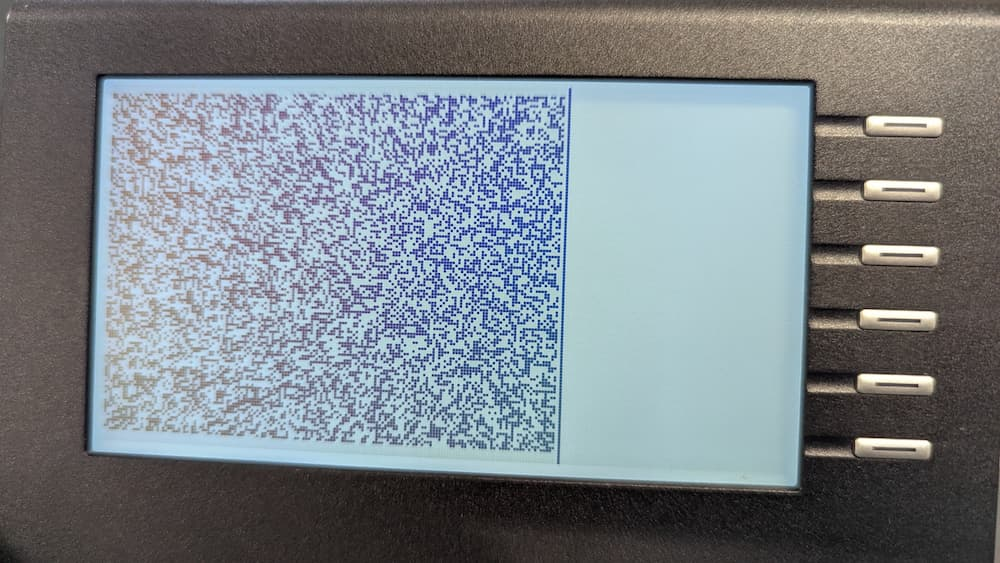
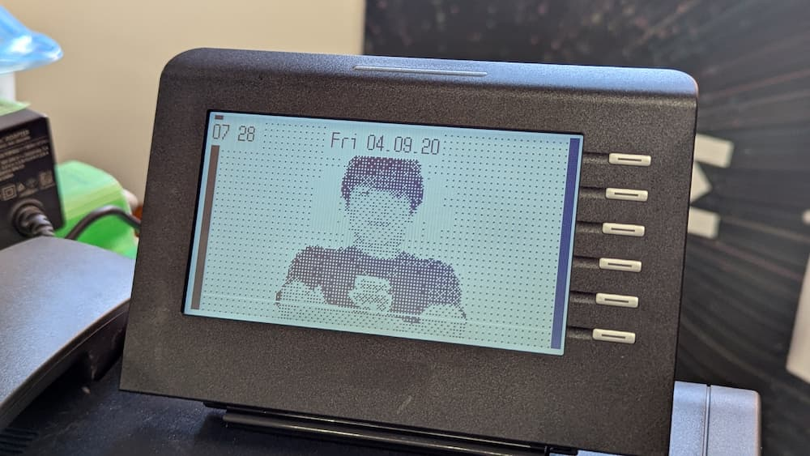

## ドイツの脆弱な電話機は<br>簡単に root が取れる
##### - 電話であそぼう -
***
<br>

#### Ryoga.exe

---

<!-- .slide: style="text-align: left;" -->
## 自己紹介

<div style="display: flex; align-items: center; justify-content: space-between;">
  <div>
<h3>Ryoga</h3>
     
- 筑波大学情報学群情報科学類
- フロントエンドと組込みの脆弱性が好き
- 最近は CSS Syntax Module Level 3 <br>を読んでいます
- X (Twitter)/mixi2: [@Ryoga_exe](https://x.com/Ryoga_exe)

  </div>

</div>

---

## 背景

---

## 時は2025年 <!-- .element: class="r-fit-text" -->

---

### 筑波大学で電話が流行



---

### 大量の電話が購入


OpenStage 40G という機種

---

何台がもらって遊ぶことに

---

### どうやら U-Boot する



---

<!-- .slide: data-background-iframe="https://wiki.unify.com/wiki/OpenStage_40" -->
<!-- .slide: style="text-align: right; border-right: solid white 4px;" -->

<div style="background: black; color: white; display: inline-block; padding-inline: 0.5em;">公式 Wiki</div>

---

- 古い Linux が動いている
- admin@ で SSH できる
- ファームウェアが配布されている

---

SSH してみる

```shell
$ ssh -o PubkeyAcceptedKeyTypes=+ssh-rsa \
-o HostKeyAlgorithms=+ssh-rsa \
-o KexAlgorithms=+diffie-hellman-group14-sha1 admin@...
```

↑ クソ古いのでクソ長い引数が必要

---

```shell
BusyBox v1.15.3 (2020-09-04 16:43:40 CEST) built-in shell (ash)
Enter 'help' for a list of built-in commands.

Sourcing Opera Environment...
FipsMode from Phone.db = false
OPENSSL_FIPS = 0
$
```

入れる

---

### 謎のリポジトリを発見

https://github.com/fffilimonov/siemen_op_firm/

"<span class="fragment highlight-red">firmware repack</span> siemens openstage 40/60/80"

---

ファームウェアは暗号化されていない



---

`/etc/shadow` を見てみる



salt なし MD5-crypt

→ GPU をぶん回す <!-- .element: class="fragment" -->

→ なんと数分で見つかる（クソ短い） <!-- .element: class="fragment" -->

---

### CVE になっているらしい

- CVE-2024-28065：
  - ファームウェアが簡単に展開できる
- CVE-2024-28066：
  - root のパスワードがクソ短い

---

## root になれない

- `root@` で SSH が拒否
- `su` → root 昇格できない

---

### ps をする

どうやら dropbear が SSH を受けている

<div class="r-stack">
  
  
</div>

---

<!-- .slide: data-auto-animate -->
<div style="font-size: 0.7em">

```shell [|1|12-13]
$ ll /usr/bin
drwxrwxr-x    2 admin    admin            0 Jan 31  2022 .
drwxrwxr-x    7 root     root             0 Jan 31  2022 ..
lrwxrwxrwx    1 admin    admin           17 Jan 31  2022 [ -> ../../bin/busybox
lrwxrwxrwx    1 admin    admin           17 Jan 31  2022 [[ -> ../../bin/busybox
lrwxrwxrwx    1 admin    admin           17 Jan 31  2022 arping -> ../../bin/busybox
lrwxrwxrwx    1 admin    admin           17 Jan 31  2022 awk -> ../../bin/busybox
lrwxrwxrwx    1 admin    admin           17 Jan 31  2022 basename -> ../../bin/busybox
lrwxrwxrwx    1 admin    admin           17 Jan 31  2022 clear -> ../../bin/busybox
lrwxrwxrwx    1 admin    admin           17 Jan 31  2022 cmp -> ../../bin/busybox
lrwxrwxrwx    1 admin    admin           17 Jan 31  2022 cut -> ../../bin/busybox
lrwxrwxrwx    1 admin    admin           13 Jan 31  2022 dropbearkey -> dropbearmulti
-rwxrwxr-x    1 admin    admin       177668 Sep  4  2020 dropbearmulti
lrwxrwxrwx    1 admin    admin           17 Jan 31  2022 du -> ../../bin/busybox
lrwxrwxrwx    1 admin    admin           17 Jan 31  2022 env -> ../../bin/busybox
lrwxrwxrwx    1 admin    admin           17 Jan 31  2022 expr -> ../../bin/busy
```

</div>

→ admin admin……🤔 <!-- .element: class="fragment" -->

---

## dropbear を書き換えてみる <!-- .element: class="r-fit-text" -->

---


<!-- .slide: data-auto-animate -->
## 概要

<pre data-id="code-animation"><code data-trim data-line-numbers>
if (-w があったら) {
    root でのログインをしない
    ...
    ...
}
</code></pre>

---

<!-- .slide: data-auto-animate -->
## 概要

<pre data-id="code-animation"><code data-trim data-line-numbers>
if (-w があったら) {
    NOP NOP NOP
    NOP NOP NOP
}
</code></pre>

NOP 埋めする

---

```shell
$ (sh -c 'sleep 60 && cp ... /usr/bin/dropbearmulti') &
```

書き換えようとするとText file busy と言われるので

60秒後差し替えるように→SSHを止める<br>→待つ→再起動

---

## こうして root になれた（めでたい）  <!-- .element: class="r-fit-text" -->

```shell
$ ssh -o PubkeyAcceptedKeyTypes=+ssh-rsa \
-o HostKeyAlgorithms=+ssh-rsa \
-o KexAlgorithms=+diffie-hellman-group14-sha1 root@...

...

# id
uid=0(root) gid=0(root) groups=0(root),10(wheel)
```

---

## root になれると

```shell
$ cat /dev/urandom > /dev/fb0
```

フレームバッファに書き込める

---



---

## カーネルモジュールを解析して<br>任意の画像を表示可能になる



---

### 備考

---

### 本機種の権限昇格は既知の問題らしい

<https://www.pentagrid.ch/en/blog/rce-and-local-root-in-openstage-and-openscape-phones/>

---

### <span style="background: white">たくさんの犠牲に🙏</span>

<!-- .slide: data-background-image="./breaking.jpg" -->

---

### 追記

セキュキャン後、やる気が出たので<br>音を出すために解析を続けている

↓意味のわからないファイルで発狂している様子
<blockquote class="bluesky-embed" data-bluesky-uri="at://did:plc:b5s4tjegojtywgycglpjtheg/app.bsky.feed.post/3mtbruk6pi22z" data-bluesky-cid="bafyreib5cw3ufz443vslzfy3jqoj3zffpjbwxn7luym3lvhafdm3ogzngu" data-bluesky-embed-color-mode="system"><p lang="ja">例のドイツの電話機を解析しているが、中身が midi の嘘の wav ファイルで発狂している<br><br><a href="https://bsky.app/profile/did:plc:b5s4tjegojtywgycglpjtheg/post/3mtbruk6pi22z?ref_src=embed">[image or embed]</a></p>&mdash; 📦️ (<a href="https://bsky.app/profile/did:plc:b5s4tjegojtywgycglpjtheg?ref_src=embed">@ryoga.dev</a>) <a href="https://bsky.app/profile/did:plc:b5s4tjegojtywgycglpjtheg/post/3mtbruk6pi22z?ref_src=embed">2026年8月17日 22:15</a></blockquote><script async src="https://embed.bsky.app/static/embed.js" charset="utf-8"></script>
